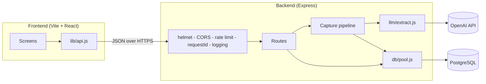

# Architecture

NEXT Africa is a small, boring-on-purpose stack: one Express API backed by
PostgreSQL, and one React single-page app. The interesting work happens in the
capture pipeline, which turns free text into structured, linked commitments.

## Request lifecycle

1. `helmet`, CORS, JSON parsing, request-id, and structured logging middleware run.
2. A rate limiter protects `/api`, with tighter budgets on `/api/auth` and capture.
3. Zod validates the body; `requireAuth` verifies the bearer JWT.
4. Handlers call `db/pool.js` (parameterised SQL only) or the capture pipeline.
5. Errors flow to the central error handler, which logs with the request id and
   returns a generic message to the client.

## Capture pipeline

`POST /api/capture`, `/file`, and `/voice` converge on `persistCapture`:

1. Text is extracted directly; files are base64-decoded; voice notes are
   transcribed by OpenAI first.
2. `extractCommitments` calls OpenAI Chat Completions with a forced tool call
   (`record_commitments`), returning `{ reply, commitments[] }`.
3. Inside one transaction, each commitment is inserted. Optional `linked_to_title`
   links a new commitment to an existing open one, forming project chains.
4. Overlapping deadline/meeting times (within ±2h) create a persisted conflict nudge.

## Data model

- `users` — account + `proactivity_level`.
- `commitments` — the unit of work; self-referencing `linked_commitment_id` forms chains.
- `nudges` — conflict/due/waiting reminders with a unique `(user_id, source_key)`.

Migrations live in `backend/migrations` and are applied by
`backend/src/db/migrate.js`; the applied set is tracked in `schema_migrations`.

## Frontend structure

- `src/lib` — `api`, `session` (localStorage), `format`, `monitoring`.
- `src/components` — shared `Brand` atoms and the `ErrorBoundary`.
- `src/App.jsx` — screens and routing (may be split further into `features/`).

## Deployment

- Frontend: Cloudflare Pages (`frontend/wrangler.toml`, `_redirects`, `_headers`).
- Backend: any Node host (Render/Fly/Railway/VPS) with managed Postgres.
- CI runs lint, backend tests, and the frontend build; CD publishes Pages and
  packages the backend.
